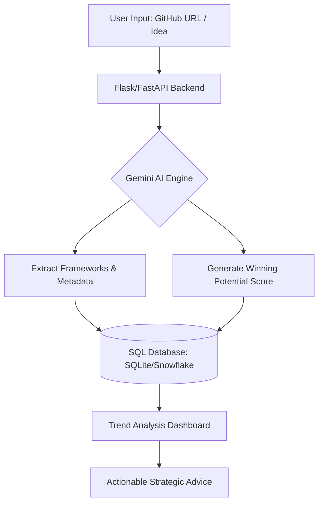

# HackWreck

HackWreck is a project analyzer designed for hackathon participants. It leverages Google Gemini AI to evaluate GitHub repositories, identify winning trends, and provide strategic recommendations to help users increase their competitive edge.

## Installation Instructions and Dependencies

To set up HackWreck locally, follow the steps below.

### 1. Clone the Repository
```bash
git clone https://github.com/edwinb1067/HackWreck
cd HackWreck
```

### 2. Install Python Dependencies
The backend requires Python 3.x and several libraries for AI integration and environment management.
```bash
pip install google-genai python-dotenv flask flask-cors
```

### 3. Configure Environment Variables
Create a `.env` file in the `DevScrape/` directory to store your API credentials.
```env
GOOGLE_API_KEY=your_google_api_key_here
```
You can obtain an API key from [Google AI Studio](https://aistudio.google.com/apikey).

### 4. Initialize the Database
Run the database initialization script to create the local SQLite schema.
```bash
cd DevScrape
python devWeb.py
```

### 5. Run the Application
To start the analysis engine:
```bash
python scrape.py
```

---

## How It Works and Background Knowledge

HackWreck operates as a bridge between raw project data and actionable intelligence. It uses a multi-layered approach to process hackathon entries.

### Data Extraction and AI Analysis
The system takes a GitHub URL or a project description as input. It uses the Gemini AI engine to perform "Semantic Search" and code analysis. Gemini parses the README and repository structure to categorize the project (e.g., AI, FinTech, Web3) and identify the tech stack used.

### Scoring Logic
Each project is evaluated based on specific judging criteria typical of high-level hackathons:
*   **Technical Complexity:** Evaluation of the frameworks and logic implemented.
*   **Originality:** Comparison against existing projects in the database.
*   **Winning Potential:** A score from 0 to 10 based on historical trends of winning projects.

### Natural Language to SQL
The system allows users to query the database using natural language. For example, a user can ask, "What frameworks are most common in winning AI projects?" The AI converts this prompt into a SQL query, executes it against the SQLite/Snowflake database, and returns a formatted recommendation.

### Database Schema
The system stores data in a relational format to allow for complex trend analysis:
```sql
CREATE TABLE hacks (
    id INTEGER PRIMARY KEY AUTOINCREMENT,
    name TEXT NOT NULL,
    framework TEXT,
    githubLink TEXT,
    place TEXT,           -- 'Winner' or 'Participant'
    topic TEXT,           -- Category (AI, FinTech, etc.)
    descriptions TEXT,
    ai_score FLOAT,       -- 0.0 to 10.0
    ai_reasoning TEXT     -- AI-generated qualitative feedback
);
```

---

## System Architecture

The following diagram illustrates the flow of data from the initial user input through the AI processing layer to the final storage and recommendation output.



---

## Future Work

The roadmap for HackWreck includes several enhancements aimed at performance and user experience:

*   **Semantic Caching:** To reduce API costs and latency, the system will implement a cache layer. If a similar query is made within a short timeframe, the system will serve the result from the `search_cache` table instead of calling the Gemini API.
*   **Google Search Grounding:** Integrating real-time Google Search grounding will allow the AI to cross-reference project ideas with the most recent hackathon winners globally, ensuring recommendations are up-to-date.
*   **Automated Scraper Lite:** Development of a BeautifulSoup-based scraper to automatically pull project links and placement status from platforms like Devpost.
*   **Cloud Scalability:** Migrating from local SQLite to Snowflake or Supabase for production-grade data handling and remote access.
*   **Feasibility Scoring:** A feature to evaluate a project idea against a specific hackathon timeframe (e.g., 24 hours vs. 48 hours) to provide a "Realistic Completion" score.

---

## Conclusion

HackWreck transforms the way participants approach hackathons by replacing guesswork with data-driven insights. By combining the analytical power of Gemini AI with a structured repository of past project outcomes, the tool identifies the specific technical and conceptual markers that lead to success. Whether through batch importing historical data or analyzing a fresh project idea, HackWreck serves as a comprehensive strategist for the modern developer.

# HackWreck

A hackathon project analyzer that uses AI to identify winning trends and provide strategic advice for future hackathon participants.

> **Submission for the Hacks for Hackers hackathon**

## Features

-  **Auto-analyze GitHub repos** - Gemini extracts project details, frameworks, and categories
-  **AI Scoring** - Each project gets a "winning potential" score (0-10) with reasoning
-  **Trend Analysis** - Find patterns among winning projects
-  **Strategic Advice** - Get personalized recommendations based on your project idea
-  **Batch Import** - Bulk insert projects from a text file

## Setup

### 1. Clone the repository
```bash
git clone https://github.com/your-username/HackWreck.git
cd HackWreck
```

### 2. Install dependencies
```bash
pip install google-genai python-dotenv
```

### 3. Set up environment variables
Create a `.env` file in the `DevScrape/` folder:
```env
GOOGLE_API_KEY=your_google_api_key_here
```

> Get your API key from [Google AI Studio](https://aistudio.google.com/apikey)

### 4. Initialize the database
```bash
cd DevScrape
python devWeb.py
```

## Usage

Run the main script:
```bash
python scrape.py
```

### Options:
1. **Insert a single project** - Analyze a GitHub repo and add to database
2. **Find trends with Gemini** - Get AI-powered advice for your hackathon idea
3. **Batch insert from file** - Import multiple projects from a text file
4. **Exit**

### Batch Import Format
Create a text file with one entry per line:
```
https://github.com/user/repo1, winner
https://github.com/user/repo2, participant
```

Or just URLs (specify default status when prompted):
```
https://github.com/user/repo1
https://github.com/user/repo2
```

## Project Structure

```
HackWreck/
├── README.md
├── DevScrape/
│   ├── scrape.py       # Main script with all functions
│   ├── devWeb.py       # Database initialization
│   ├── hackathons.db   # SQLite database (created on first run)
│   └── .env            # API keys (not committed)
```

## Dependencies

| Package | Purpose |
|---------|---------|
| `google-genai` | Google Gemini AI API client |
| `python-dotenv` | Load environment variables from .env |
| `sqlite3` | Database (built into Python) |

## Database Schema

```sql
CREATE TABLE hacks (
    id INTEGER PRIMARY KEY AUTOINCREMENT,
    name TEXT NOT NULL,
    framework TEXT,
    githubLink TEXT,
    place TEXT,           -- 'Winner' or 'Participant'
    topic TEXT,           -- Category (AI, FinTech, etc.)
    descriptions TEXT,
    tableNumber INTEGER,
    ai_score FLOAT,       -- Winning potential (0.0-10.0)
    ai_reasoning TEXT     -- Explanation for the score
);
```

## License

MIT
